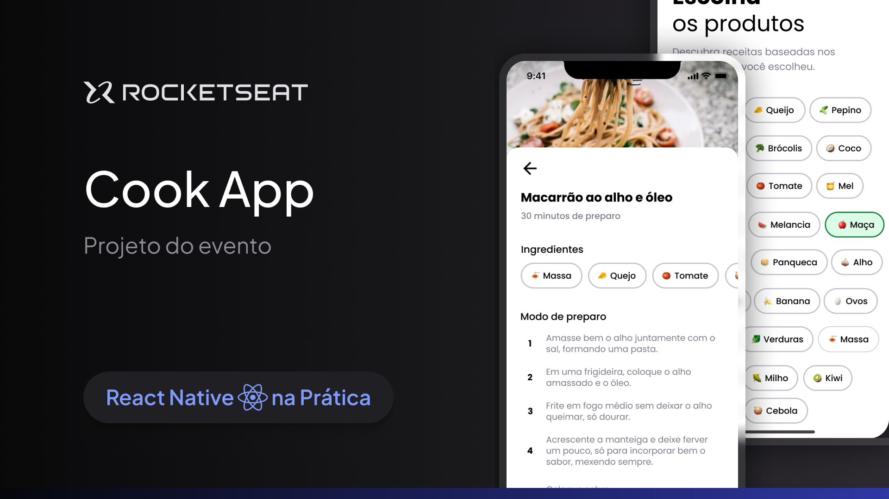

# Cook App



## About the project

This is a mobile application for cooking recipes. Users search for recipes based on ingredients, and can view the recipe details, ingredients, and instructions. Built in Expo(React Native) and Supabase backend, with a focus on user experience.

### Built With

[![Expo][Expo]][Expo-url]

[![React Native][React-Native]][React-Native-url]

[![Supabase][Supabase]][Supabase-url]


## Getting Started

Follow the steps below to run the project.

### Prerequisites

To run this project, you will need:

* npm

  ```sh
  npm install npm@latest -g
  ```

### Installation

1. Create a Supabase account and project.

2. Clone the repo
 ```sh
git clone https://github.com/EdlanioJ/cook.git
```

3. Install NPM packages
```sh
npm install
```

4. Create a Supabase database and tables and  migrations with data on `src/database/`.

#### Tables 

    recipes

|Field |Type | Description |
|---|---|---|
|id|string| Primary key (UUID)|
|name|string| Recipe name |
|image|string| Recipe image |
|minutes|int| Recipe cooking time |

    ingredients

|Field |Type | Description |
|---|---|---|
|id|string| Primary key (UUID)|
|name|string| Ingredient name |
|image|string| Ingredient image |

    recipes_ingredients

|Field |Type | Description |
|---|---|---|
|id|string| Primary key (UUID)|
|recipe_id|string| Recipe id (foreign key references recipes.id) |
|ingredient_id|string| Ingredient id (foreign key references ingredients.id) |

    preparations

|Field |Type | Description |
|---|---|---|
|id|string| Primary key (UUID) |
|recipe_id|string| Recipe id (foreign key references recipes.id) |
|step|int| Step number |
|description|string| Step description |


5. Add file in folder image in supabase storage and get the base url of the image.

6. Enter your env variables in `.env`

```ts
EXPO_PUBLIC_SUPABASE_URL='enter your supabase url'

EXPO_PUBLIC_SUPABASE_ANON_KEY='enter your supabase anon key'

EXPO_PUBLIC_STORAGE_URL='enter your supabase storage url'
```


### Run

Run in [Expo Go](https://expo.dev/go)

```js
npx expo start
```

Run in a Emulator

```ts
// iOS Emulator
npx expo run:ios

// Android Emulator
npx expo run:android

```

## Usage

To utilize Cook App, follow these steps:

1. Search for recipes by selecting ingredients.

2. Select a recipe to view its details.

3. View the recipe details, ingredients, and instructions.


## Layout

You may view the layout of this project through this [link :link:](https://www.figma.com/file/0O1ME2jskDBSua4tBDFTWg/Cook-App-(Community)?type=design&mode=design&t=7bcTmCpTFdD41upe-0). You must have an account at [Figma](https://figma.com) to access it.

## License

This project is under the MIT license. See the [LICENSE](LICENSE) file for more details.
<br/>

Made with :heart: por [Edlâneo Manuel](https://github.com/EdlanioJ) :wave:


[React-Native]: https://img.shields.io/badge/React%20Native-61DAFB?style=for-the-badge&logo=react&logoColor=ffffff
[React-Native-url]: https://reactnative.dev/

[Expo]: https://img.shields.io/badge/Expo-000000?style=for-the-badge&logo=expo&logoColor=ffffff
[Expo-url]: https://expo.io/

[Supabase]: https://img.shields.io/badge/Supabase-3ecf8e?style=for-the-badge&logo=supabase&logoColor=ffffff
[Supabase-url]: https://supabase.com/


